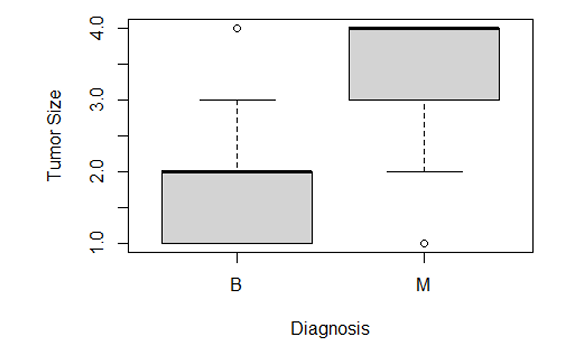
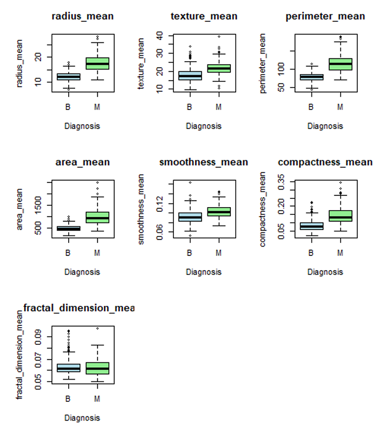
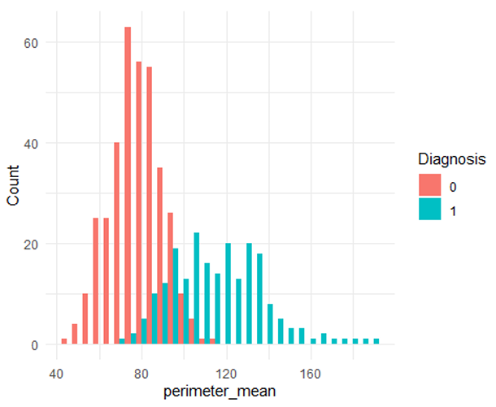
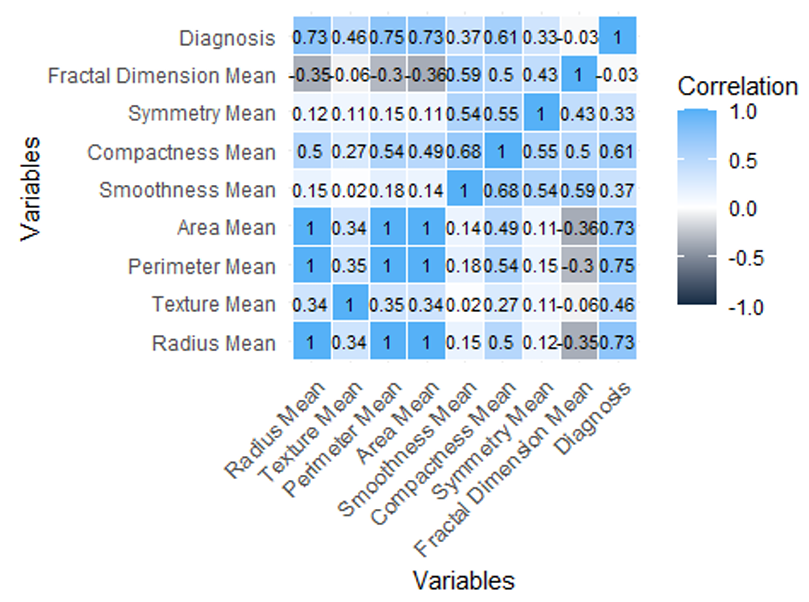
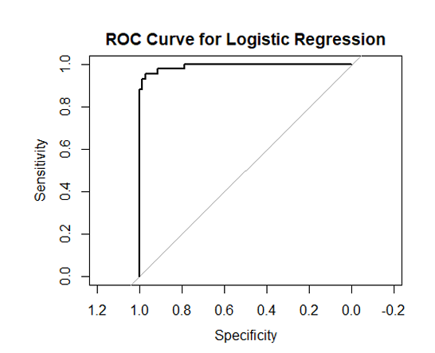

# Breast Cancer Diagnosis Prediction using Applied Statistics and Machine Learning

Breast cancer is a major global public health concern, where early and accurate diagnosis is essential for improving treatment outcomes and survival rates. This project analyzes breast tumor morphology using the Wisconsin Diagnostic Breast Cancer (WDBC) dataset to identify significant factors associated with malignant and benign diagnoses through exploratory data analysis, statistical hypothesis testing, and machine learning techniques.

The analysis focuses on tumor morphological characteristics derived from fine needle aspirate (FNA) images, including radius, texture, perimeter, area, smoothness, compactness, symmetry, and fractal dimension. Statistical methods and logistic regression modeling are applied to assess relationships between these features and breast cancer diagnosis, supporting data-driven clinical decision-making.

---

## Breast Cancer Overview

### Definition
Breast cancer is characterized by the uncontrolled growth of abnormal cells in breast tissue, which may form malignant tumors capable of invading surrounding tissue and spreading to other parts of the body.

### Importance of Early Detection
- Enables timely treatment and improved survival outcomes  
- Reduces the likelihood of metastasis  
- Supports personalized and risk-based clinical decision-making  

### Morphological Risk Indicators
- Tumor size  
- Tumor perimeter and area  
- Tissue smoothness and compactness  
- Cellular symmetry  
- Structural irregularities in tumor shape  

---

## Aim and Purpose

### Aim
To investigate the association between breast tumor morphological characteristics and the likelihood of malignant or benign breast cancer diagnosis.

### Purpose
This study aims to identify statistically significant tumor features that contribute to breast cancer diagnosis. The findings are intended to assist clinicians and healthcare professionals in improving diagnostic accuracy using quantitative tumor morphology analysis.

---

## Research Hypothesis

- **Null Hypothesis (H₀):** There is no significant association between tumor morphological characteristics and breast cancer diagnosis.  
- **Alternative Hypothesis (H₁):** There is a significant association between tumor morphological characteristics and breast cancer diagnosis.

---

## Dataset Description

- **Dataset:** Wisconsin Diagnostic Breast Cancer (WDBC)  
- **Source:** UCI Machine Learning Repository / Kaggle  
- **Format:** CSV  
- **Size:** 569 records × 30 numerical features  
- **Target Variable:** Diagnosis (Malignant / Benign)  

### Data Types

**Categorical Variables**
- Diagnosis (Malignant / Benign)  
- Tumor Size (derived variable)

**Numerical Variables**
- Radius mean  
- Texture mean  
- Perimeter mean  
- Area mean  
- Smoothness mean  
- Compactness mean  
- Symmetry mean  
- Fractal dimension mean  

---

## Methodology

### Data Collection
The dataset was imported into R and inspected to understand its structure, dimensions, and variable types.

### Data Cleaning and Preprocessing
- Standardized column names  
- Verified absence of missing and duplicate values  
- Identified and treated outliers using the **3-sigma rule**  
- Converted diagnosis variable into categorical and numerical formats  
- Created a derived variable **tumor_size** using quartiles of `radius_mean` for visualization  

---

## Exploratory Data Analysis (EDA)

EDA was conducted to examine differences in tumor morphology between malignant and benign cases.

---

## Results

This section summarizes the key findings from exploratory data analysis, statistical testing, and machine learning modeling used to assess breast cancer diagnosis based on tumor morphological characteristics.

---

### Tumor Size Distribution

This visualization illustrates the distribution of tumor sizes derived from quartile-based categorization of tumor radius. Malignant tumors are more frequently observed in larger size categories compared to benign tumors, indicating a strong association between tumor size and cancer diagnosis.

---

### Boxplot of Tumor Characteristics by Diagnosis

The boxplots compare major tumor morphology features—including radius, perimeter, area, smoothness, and compactness—across malignant and benign diagnoses. Malignant tumors consistently exhibit higher median values and greater variability, suggesting these features are strong indicators of malignancy.

---

### Density Plot of Perimeter Mean

The density plot highlights the distribution of perimeter mean values across tumor types. Malignant tumors tend to have higher perimeter measurements, further supporting the relationship between tumor boundary expansion and cancer severity.

---

### Spearman Correlation Heatmap of Tumor Features

The Spearman correlation heatmap reveals strong positive correlations among size-related tumor features such as radius, perimeter, area, and compactness. These findings indicate multicollinearity among morphological variables, which is consistent with known tumor growth patterns.

---

### ROC Curve for Logistic Regression Model

The Receiver Operating Characteristic (ROC) curve evaluates the performance of the logistic regression classifier in distinguishing malignant from benign tumors. The curve demonstrates strong discriminative ability, with a high area under the curve (AUC), indicating effective classification performance.

---

## Statistical Testing

### Mann–Whitney U Test
- Applied due to non-normal distributions  
- All tumor features were statistically significant (**p < 0.05**) except `fractal_dimension_mean`

### Chi-Square Test
- Conducted between **tumor_size** and diagnosis  
- Highly significant association (**p < 2.2e-16**)

**Result:** The null hypothesis was rejected, confirming statistically significant associations.

---

## Machine Learning Model

### Logistic Regression
A logistic regression classifier was implemented to predict breast cancer diagnosis using tumor morphological features. The model demonstrated strong classification performance and effective separation between malignant and benign tumors.

---

## Conclusion

- Tumor morphology is significantly associated with breast cancer diagnosis  
- Logistic regression demonstrated strong discriminatory performance  
- Findings support quantitative morphology-based diagnostic approaches for early detection  

---

## Limitations

- Small dataset limits generalizability  
- Lack of patient-level clinical history  
- Tumor size derived statistically rather than clinically  

---

## Code

- Full analysis is available in:
  - `breast_cancer_project.Rmd`
- The R Markdown file includes:
  - Data preprocessing  
  - Statistical testing  
  - Visualization  
  - Logistic regression and ROC analysis  

---
